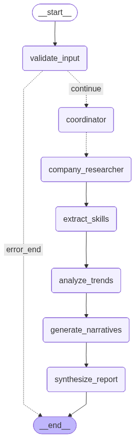

# HireSignal

**Decode AI lab hiring patterns into actionable intelligence.**


---

## The Problem

AI labs move fast. By the time a funding announcement drops or a product launches, the signal has already been sitting in their job postings for months. Every new "alignment researcher" posting, every "inference optimization" role, every cluster of "foundation model" hires tells a story -- if you can read it.

The problem is that nobody reads it systematically. Job boards are noisy, unstructured, and scattered across dozens of sites. Connecting a hiring surge to a research direction requires correlating job postings, arXiv papers, funding news, and domain taxonomy in a way that is impossible to do manually at scale.

**HireSignal automates exactly that.**

---

## The Solution

HireSignal is a production-grade **LangGraph agentic pipeline** that ingests raw hiring signals from across the web, applies a structured AI domain taxonomy to extract intent, and synthesizes everything into a ranked intelligence brief. It answers the question: *who is building what, and how urgently?*

The pipeline runs fully asynchronously, fans out research across companies in parallel, computes explainable 0-100 intent scores backed by real signals, and delivers both a REST API response and a rendered Streamlit dashboard.

---

## Pipeline Architecture

The pipeline is a directed acyclic graph compiled by LangGraph. Each box is a stateful node. The fan-out at `coordinator` spawns one `company_researcher` worker per company, all running concurrently via LangGraph's `Send()` API. Results are merged back via a custom reducer before downstream sequential nodes run.



| Node | Role |
|---|---|
| `validate_input` | Normalizes company names, initializes all state fields |
| `coordinator` | Routing checkpoint before parallel fan-out |
| `company_researcher` | Parallel: fetches job postings, news, funding, arXiv papers per company |
| `extract_skills` | LLM-extracts skills, domains, role types, team signals from posting text |
| `analyze_trends` | Computes velocity deltas, scores AI intent with breakdown |
| `generate_narratives` | LLM writes per-company intelligence narratives |
| `synthesize_report` | LLM synthesizes a final ranked intelligence brief |

---

## Key Features

**Explainable intent scoring**
Every 0-100 score comes with a full breakdown: base score, job volume bonus, high-signal domain bonus, funding bonus, and papers bonus. The Streamlit UI surfaces a "Why this score?" panel so the number is never a black box.

**Parallel company research**
`company_researcher` runs as N concurrent workers via LangGraph's `Send()` fan-out pattern. A `merge_dicts` reducer cleanly aggregates all parallel writes without race conditions.

**Multi-source signal fusion**
Each company is researched across four sources: Greenhouse API (structured job board), Tavily web search (job postings and news), company funding/partnership news, and arXiv papers (cs.AI, cs.LG, cs.CL). No API key required for arXiv.

**Structured JSON observability**
Every node emits structured JSON entry/exit logs with per-node latency. `company_researcher` logs fetch success per source. `analyze_trends` logs each scored company. All output is LangSmith-compatible.

**Fault-tolerant tool calls**
All four external tool calls in `company_researcher` are wrapped in `_fetch_with_retry` with configurable retries and backoff. Each source degrades independently: a failed job fetch does not block news or papers.

**Dual LLM provider support**
Switch between Groq (llama-3.3-70b-versatile, default) and OpenAI (gpt-4o-mini) via a single config change or API parameter. Model names are read from `config.yaml`, not hardcoded.

---

## Tech Stack

| Layer | Technology |
|---|---|
| Agentic orchestration | LangGraph 0.2+, LangChain 0.3+ |
| LLM providers | Groq (llama-3.3-70b-versatile), OpenAI (gpt-4o-mini) |
| Web search | Tavily (via langchain-tavily), Greenhouse public API, arXiv API |
| API server | FastAPI 0.115+, Uvicorn, Pydantic v2 |
| Frontend | Streamlit 1.40+ |
| Observability | Structured JSON logging, LangSmith tracing support |
| Package management | uv, pyproject.toml |
| Language | Python 3.11+ |

---

## Intent Score Formula

The intent score is fully deterministic and explainable. No LLM is involved in scoring.

| Signal | Max Points | Trigger |
|---|---|---|
| Base | 30 | Always |
| Job volume | +25 | AI role keywords (engineer, scientist, researcher) in posting text |
| High-signal domains | +25 | Domains like alignment, foundation models, inference optimization |
| Funding / partnership news | +10 | Keywords: raised, series, investment, acquired, partnership |
| Recent arXiv papers | +10 | Papers found in cs.AI / cs.LG / cs.CL |
| **Total (capped)** | **100** | |

Bands: **75+ = HIGH**, 55-74 = MEDIUM, 35-54 = LOW-MEDIUM, below 35 = LOW.

The score breakdown is returned in the API response under `intent_breakdowns` and displayed in the Streamlit UI under "Why this score?".

---

## Quickstart

### Prerequisites

- Python 3.11+
- [uv](https://docs.astral.sh/uv/) (recommended) or pip
- API keys: Groq + Tavily (free tiers work fine)

### Install and run

```bash
# 1. Clone
git clone https://github.com/yourname/hiresignal
cd hiresignal

# 2. Install dependencies
uv sync

# 3. Configure environment
cp .env.example .env
# Fill in GROQ_API_KEY and TAVILY_API_KEY at minimum
```

```bash
# Terminal 1: start the FastAPI backend
uv run uvicorn main:app --reload
```

```bash
# Terminal 2: start the Streamlit frontend
uv run streamlit run frontend/app.py
```

Open [http://localhost:8501](http://localhost:8501), select companies, set a lookback window, and click **Run analysis**.

### pip alternative

```bash
python3.11 -m venv .venv
.venv/bin/pip install -r requirements.txt -e .
.venv/bin/uvicorn main:app --reload
```

---

## API Reference

### `POST /analyze`

Run the full pipeline for a list of companies.

**Request**
```json
{
  "companies": ["Anthropic", "OpenAI", "Google DeepMind"],
  "timeframe_days": 30,
  "model_provider": "groq"
}
```

**Response**
```json
{
  "final_report": "# HireSignal Intelligence Brief\n...",
  "companies_analyzed": ["Anthropic", "OpenAI", "Google DeepMind"],
  "intent_scores": {
    "Anthropic": 85,
    "OpenAI": 72,
    "Google DeepMind": 68
  },
  "intent_breakdowns": {
    "Anthropic": {
      "base": 30,
      "job_volume_bonus": 15,
      "domain_bonus": 20,
      "funding_bonus": 10,
      "papers_bonus": 10,
      "total": 85,
      "signals_found": [
        "12 AI role keywords found in job postings",
        "4 high-signal domains detected: alignment, foundation models, inference optimization, fine-tuning",
        "Funding/partnership news detected",
        "Recent arXiv papers found"
      ]
    }
  },
  "company_narratives": { "Anthropic": "..." },
  "report_filepath": "./output/hiresignal_2025-03-10_14-22-00.md"
}
```

**curl example**
```bash
curl -X POST http://localhost:8000/analyze \
  -H "Content-Type: application/json" \
  -d '{"companies": ["Anthropic", "OpenAI", "Mistral"], "timeframe_days": 30}'
```

### `GET /health`

```json
{"status": "ok", "pipeline": "compiled"}
```

---

## Export the pipeline diagram

```bash
uv run scripts/export_graph.py
```

Prints Mermaid markdown to stdout and writes `assets/pipeline_graph.png`. If Graphviz is not installed, paste the Mermaid output at [mermaid.live](https://mermaid.live).

---

## LangSmith tracing

Add these to your `.env` to get per-node traces in LangSmith:

```env
LANGSMITH_TRACING=true
LANGSMITH_API_KEY=your_key_here
LANGSMITH_PROJECT=hiresignal
```

---

## Project Structure

```
hiresignal/
├── agent/
│   └── agentic_workflow.py       # LangGraph GraphBuilder, 7 nodes, TalentSignalState
├── tools/
│   ├── job_search_tool.py        # @tool wrappers: search_ai_job_postings, get_posting_velocity
│   ├── company_news_tool.py      # @tool wrappers: get_company_ai_news, get_funding_and_partnerships
│   ├── skill_extractor_tool.py   # @tool wrapper: extract_ai_skills
│   └── trend_delta_tool.py       # @tool wrappers: calculate_hiring_delta, score_ai_intent
├── utils/
│   ├── skill_taxonomy.py         # SKILL_DOMAIN_MAP, compute_intent_score() -> (score, breakdown)
│   ├── trend_calculator.py       # TrendCalculator.compute_delta()
│   ├── data_store.py             # JSON snapshot persistence for delta computation
│   ├── job_fetcher.py            # Greenhouse API + Tavily job search
│   ├── news_fetcher.py           # Tavily news and funding search
│   ├── arxiv_fetcher.py          # arXiv API (no key required)
│   ├── model_loader.py           # Groq / OpenAI LLM loader from config
│   └── report_exporter.py        # Markdown report export to output/
├── prompt_library/
│   └── prompts.py                # NARRATIVE_PROMPT, ORCHESTRATOR_PROMPT
├── frontend/
│   └── app.py                    # Streamlit dashboard with intent score leaderboard
├── scripts/
│   └── export_graph.py           # Export compiled graph as PNG + Mermaid
├── assets/
│   └── pipeline_graph.png        # Auto-generated by scripts/export_graph.py
├── config/
│   └── config.yaml               # Model names, default companies
├── main.py                       # FastAPI app with lifespan pipeline compilation
├── .env.example                  # All required environment variables
└── pyproject.toml
```

---

## Why I built this

Recruiting and investing in AI companies is increasingly a signal-processing problem. The companies doing the most interesting work telegraph it through their hiring before anything else becomes public. I wanted to build a system that could read those signals automatically, apply a structured domain taxonomy, and surface insight that would otherwise require hours of manual research.

This project was an excuse to go deep on LangGraph's stateful multi-agent primitives, parallel fan-out execution, and the engineering tradeoffs involved in making an LLM pipeline production-ready: fault tolerance, structured logging, explainability, and clean separation between deterministic scoring logic and LLM synthesis.
